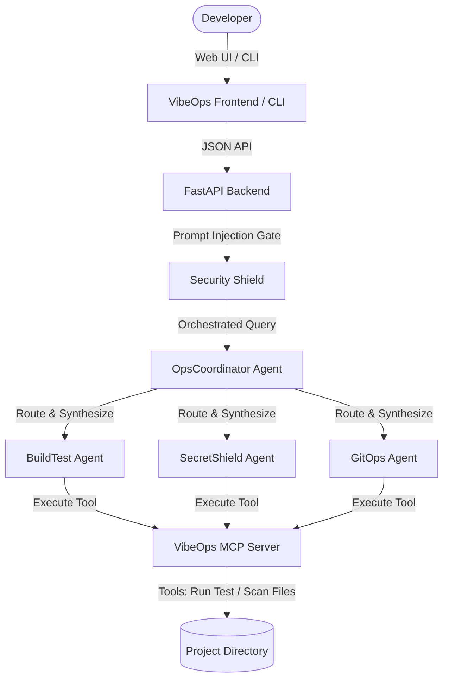

# 🌌 VibeOps: The Vibe Coding Operations Cockpit

**VibeOps** is a developer operations assistant. It connects a specialized local multi-agent system and Model Context Protocol (MCP) server directly to your coding workspace. 

VibeOps automates codebase audits, builds project targets, runs unit tests, screens for leaked credentials (API Keys), and compiles semantic Git commits—all driven by natural language prompts.

---

## 🏗️ Architecture & Technical Flow

VibeOps routes queries to specialized agents, utilizing an **MCP Server** to safely inspect and run operations in your workspace:



### 🧠 Core Course Concepts Applied:
1.  **Multi-Agent System (ADK)**:
    *   **OpsCoordinator Agent**: Serves as the dispatcher and router. It decides which agents to route queries to and synthesizes their reports.
    *   **BuildTest Agent**: Inspects project profiles (Python, Node, C#, etc.) and builds or runs test suite commands.
    *   **SecretShield Agent**: Scans project files locally to identify credentials leaks (Google API keys, AWS keys, tokens).
    *   **GitOps Agent**: Inspects uncommitted changes and formats detailed git commit messages.
2.  **Model Context Protocol (MCP) Server**:
    *   Exposes workspace structure (`mcp://workspace/files`) and git changes (`mcp://git/diff`) as resources.
    *   Exposes tools (`scan_for_secrets`, `get_build_targets`) to let agents analyze your workspace programmatically.
3.  **Command Execution Security Gates**:
    *   To keep the codebase safe, the backend enforces a strict **Command Sandbox Gate**. If the BuildTest agent plans to run `pytest` or `npm test`, it generates a card in the web console with an **"Approve & Run"** button. The command runs *only* when the developer clicks the button.
    *   Execution is whitelisted: only permits `npm`, `pip`, `python`, `pytest`, `cargo`, `go`, `dotnet`, `git`, and `echo`, and blocks shell chaining characters (`;`, `&&`, `|`).
4.  **Terminal Agent Skill (CLI)**:
    *   Includes `vibeops-cli.py` to query your agents directly from the command line (e.g. `python vibeops-cli.py "check for API key leaks"`).
5.  **Deployability**:
    *   Supplied with `start-vibeops.bat` (automated virtual environment configuration and sample sandbox files creator) and a `Dockerfile` for containerization.

---

## 🛠️ Local Setup (Windows Quickstart)

1.  **Launch the Cockpit**:
    Simply double-click the `start-vibeops.bat` file in the root of the project.
    
    *This script will automatically:*
    *   Create a `sandbox/` folder containing a mock unit test (`code_sample.py`) and a mock credential key (`secrets_check.txt`) for testing.
    *   Create a Python virtual environment (`venv`) and install dependencies.
    *   Launch the FastAPI server on `http://localhost:8000`.
    *   Open `frontend/index.html` in your default web browser.

2.  **Add your Gemini API Key**:
    *   Navigate to the **Settings** tab on the left sidebar.
    *   Enter your Gemini Developer API Key and click **Save**.
    *   The key is stored in your browser's local cache (`localStorage`) and sent via headers dynamically.

---

## 💻 Standalone Terminal Agent Skill (CLI)

You can query your agents directly from your console shell:

```bash
# Set your API Key first (or use a .env file)
set GEMINI_API_KEY=AIzaSy...

# Ask the agent to run project tests
python vibeops-cli.py "Run python tests"

# Scan the codebase for credentials leaks
python vibeops-cli.py "Scan files for API key leaks"
```
