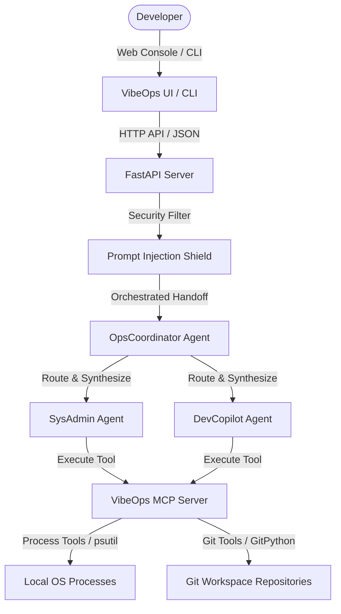

# 🌌 VibeOps: The Developer's Agentic Workspace Cockpit

**VibeOps** is a real-time developer workspace dashboard, resource health monitor, and process optimizer. It connects a local multi-agent system and Model Context Protocol (MCP) server directly to your coding workspace and OS environment. 

Designed for developers, VibeOps aggregates system resources, lists memory-hogging processes, tracks uncommitted Git repositories, and runs developer agent skills via a terminal CLI or a beautiful, glassmorphic web console.

---

## 🏗️ Architecture & Flow

VibeOps uses a **coordinator-specialist multi-agent system** combined with an **MCP Server** that exposes local workspace parameters directly to Google Gemini.



### 🧠 Course Concepts Applied:
1.  **Multi-Agent System (ADK)**:
    *   **OpsCoordinator**: Serves as the dispatcher and router. It analyzes incoming queries, delegates sub-tasks to specialists, and synthesizes reports.
    *   **SysAdmin Agent**: Analyzes resource load (CPU, RAM) and active processes. Recommends process optimizations (freeing up RAM/VRAM).
    *   **DevCopilot Agent**: Scans Git branch logs, uncommitted file status, and untracked code.
2.  **Model Context Protocol (MCP) Server**:
    *   Exposes system health (`mcp://system/metrics`) and git branch info (`mcp://git/status`) as readable resources.
    *   Exposes system tools (`get_process_list`, `reclaim_memory`, `git_diff_summary`) allowing the agents to interact programmatically with your workspace.
3.  **Security Gates & Features**:
    *   **Input Sanitization**: Block shell command injection characters (`;&|``) in developer prompts.
    *   **Prompt Injection Shield**: A regex-based shield preventing instruction-override jailbreaks.
    *   **Human-In-The-Loop (HITL) Execution Gate**: For destructive actions like process terminations (`kill`), the SysAdmin agent issues a structured tag `[RECOMMENDED_ACTION:TERMINATE:PID]`. The web dashboard captures this and renders an **Approve Action** button. The backend *never* kills a process automatically; it awaits explicit user execution.
4.  **Terminal Agent Skill (CLI)**:
    *   Includes `vibeops-cli.py` to query your agents directly from the command line.
5.  **Deployability**:
    *   Supplied with `start-vibeops.bat` (automated virtual environment setup and startup for Windows) and a `Dockerfile` for containerization.
6.  **Antigravity Collaboration**:
    *   Built through pair-programming and design iterations with **Antigravity**, Google's agentic coding companion.

---

## 🛠️ Local Setup (Windows Quickstart)

1.  **Launch the Cockpit**:
    Simply double-click the `start-vibeops.bat` file in the root of the project.
    
    *This script will automatically:*
    *   Create a Python virtual environment (`venv`).
    *   Activate the environment and install backend requirements.
    *   Launch the FastAPI server on `http://localhost:8000`.
    *   Open `frontend/index.html` in your default web browser.

2.  **Add your Gemini API Key**:
    *   Navigate to the **Settings** tab on the left sidebar.
    *   Enter your Gemini Developer API Key and click **Save**.
    *   The key is stored securely in your browser's local storage and is sent via request headers dynamically.

---

## 💻 Standalone Terminal Agent Skill (CLI)

You can query your agent cockpit directly from your console:

```bash
# Set your API Key first (or use a .env file)
set GEMINI_API_KEY=AIzaSy...

# Ask the agent about RAM usage
python vibeops-cli.py "Why is my RAM usage high? Identify heavy apps."

# Review your Git workspace changes
python vibeops-cli.py "What did I modify in git?"
```

---

## 🐳 Docker Deployment

To build and run the VibeOps backend service inside a container:

```bash
# Build the image
docker build -t vibeops .

# Run the container (Map port 8000 to local machine)
docker run -d -p 8000:8000 -e GEMINI_API_KEY=your_key_here vibeops
```

---

## 🔒 Security Specifications

*   **API Key Isolation**: Keys are sent dynamically on headers per request and never stored on the server disk.
*   **Shell Sanitization**: Raw prompts are scrubbed of process concatenation operators (`&`, `;`, `|`, etc.) to block injection into system utilities.
*   **PID Validation**: The `/api/execute-action` endpoint accepts only integer PIDs, confirms the PID is active, and verifies it does not match critical system processes or the backend server itself.
