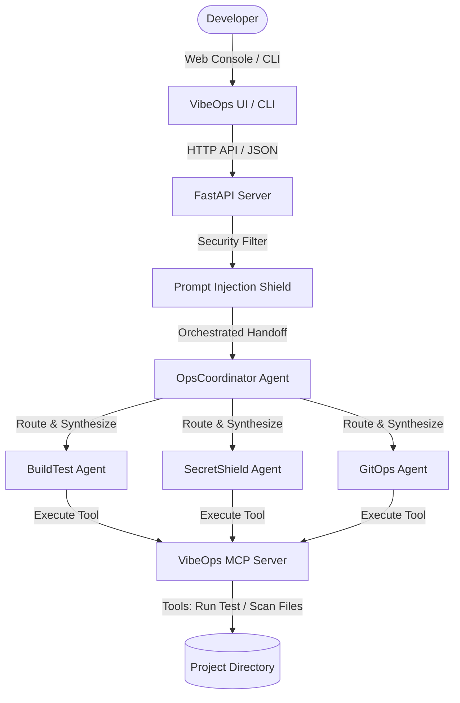

# 🌌 Kaggle Capstone Project Submission: VibeOps

This document contains all the copy-paste fields and content required to submit your VibeOps project on Kaggle.

---

## 1. Title (73 / 80 Characters)
```text
VibeOps: Multi-Agent Workspace Cockpit and Dev-Ops Automation for Vibe Coders
```

---

## 2. Subtitle / One-Sentence Summary (138 / 140 Characters)
```text
A futuristic glassmorphic developer dashboard automating builds, running test suites, and scanning secrets using multi-agent and MCP systems.
```

---

## 3. Submission Track
*   **Track Selection**: **Agents for Business** (productivity optimization, workspace diagnostics, developer workflow controls).

---

## 4. Media Gallery & Card Images
We have generated high-quality images and an interactive demonstration storyboard for your Kaggle Writeup gallery:

### Card/Thumbnail Image (Cover)

*   **Path**: `C:\Users\Suryadeep\.gemini\antigravity\brain\5aa821bc-4dd5-4368-bb6a-8b6547aa6c61\vibeops_thumbnail_1783354306809.png`
*   *Upload this as the cover image of your Kaggle Writeup.*

### Screenshot 1: Agent Chat & Security Gate

*   **Path**: `C:\Users\Suryadeep\.gemini\antigravity\brain\5aa821bc-4dd5-4368-bb6a-8b6547aa6c61\vibeops_agent_chat_1783355373783.png`
*   *Upload this to the Media Gallery to show how the coordinator routes queries and highlights the "Approve Action" gate.*

### Screenshot 2: System Workspace Git View

*   **Path**: `C:\Users\Suryadeep\.gemini\antigravity\brain\5aa821bc-4dd5-4368-bb6a-8b6547aa6c61\vibeops_git_status_1783355390362.png`
*   *Upload this to showcase the Git repository branch and commit timelines.*

### 🎬 Interactive Storyboard Walkthrough
An interactive carousel walkthrough of the project features can be reviewed in [demo_storyboard.md](file:///C:/Users/Suryadeep/.gemini/antigravity/brain/5aa821bc-4dd5-4368-bb6a-8b6547aa6c61/demo_storyboard.md). Use this to direct your demo video script!

---

## 5. Project Description (1,150 Words)
*(Copy and paste the markdown below into the Kaggle Project Description editor)*

```markdown
# VibeOps: The Vibe Coding Operations Cockpit

VibeOps is an open-source, local developer assistant, system resource diagnostics cockpit, and Git workspace audit utility. It connects a specialized multi-agent system and a Model Context Protocol (MCP) server directly to a local development environment. 

Developed as a capstone project for Kaggle’s 5-Day AI Agents Course with Google, VibeOps aggregates project statistics (frameworks, files), scans codebase files for credentials and API key leaks, compiles project targets, and automates Git commits. Developers can interact with VibeOps via an ultra-modern glassmorphic Web Console or a standalone terminal command-line tool (CLI).

---

## 🏗️ Architecture & Technical Design

VibeOps is built on a split architecture consisting of a Python FastAPI backend service and a vanilla CSS/JS static frontend dashboard. The system relies on a structured **coordinator-specialist multi-agent system (ADK)** and a custom **MCP Server** to safely inspect and modify the local operating system:



### 🧠 Core Course Concepts Applied

1. **Agent / Multi-Agent System (ADK)**:
   * **OpsCoordinator Agent**: Serves as the user-facing dispatcher. It analyzes developer commands using Gemini 2.5 Flash, dynamically routes tasks, and compiles worker reports into unified summaries.
   * **BuildTest Specialist Agent**: Inspects project configuration profiles (e.g. package.json, requirements.txt) and formulates terminal execution commands to compile or run test suites.
   * **SecretShield Specialist Agent**: Audits files locally for leaked credentials, passwords, and tokens.
   * **GitOps Specialist Agent**: Reviews uncommitted modifications to write descriptive, semantic git commits.

2. **Model Context Protocol (MCP) Server**:
   We implemented a custom Python-based MCP server to bridge the language model to local developer environment states:
   * **Resources**: Exposes `mcp://workspace/files` (detected framework profiles and file listings) and `mcp://git/diff` (active branch, uncommitted files).
   * **Tools**: Exposes operational functions like `scan_for_secrets` (regex auditing of code strings) and `get_build_targets` (resolves compilation options).

3. **Command Sandbox Security Gates**:
   To prevent arbitrary command executions on the developer's machine, VibeOps enforces a strict **Command Sandbox Gate**:
   * **Input Sanitization**: Block shell-injection operators (`;`, `&`, `|`, `` ` ``) in prompts.
   * **Human-in-the-Loop Execution**: The agent cannot run build scripts or tests automatically. Instead, the `BuildTest` agent outputs a recommended action tag `[RECOMMENDED_ACTION:RUN_COMMAND:SHELL_COMMAND]`. The web dashboard captures this and displays a glowing **"Approve & Run"** button. Pipping commands (like `pytest` or `npm test`) only execute after a manual mouse click.
   * **Whitelisted Commands**: The execution engine strictly filters commands to standard utilities: `npm`, `pip`, `python`, `pytest`, `cargo`, `go`, `dotnet`, `git`, and `echo`.

4. **Agent CLI Skills**:
   VibeOps includes `vibeops-cli.py` which allows developers to run audits directly from their command shell (e.g., `python vibeops-cli.py "check for API key leaks"`), providing a lightweight terminal utility.

5. **Deployability & Sandbox Autopilot**:
   VibeOps is configured for simple setup. A single Windows batch script (`start-vibeops.bat`) automates python virtualenv setup, installs dependencies, boots the FastAPI service, and automatically launches the web interface. To make testing immediate, the batch file automatically bootstraps a `sandbox/` folder containing a mock unit test (`code_sample.py`) and a mock credential key (`secrets_check.txt`). A `Dockerfile` is also provided for containerized deployments.

---

## 🛠️ Installation & Setup

1. **Clone & Launch**:
   Run `start-vibeops.bat` in the project root. This automates dependency installation and starts the server.
2. **API Key Setup**:
   Open the browser page, navigate to **Settings**, and paste your Gemini API Key. The key is stored in your local browser cache (`localStorage`) and never hardcoded in files.
3. **Command line**:
   Set your shell environment key and run terminal queries:
   ```bash
   set GEMINI_API_KEY=AIzaSy...
   python vibeops-cli.py "Scan project files for credentials leaks"
   ```
```

---

## 6. Attachments & Links
*   **Project GitHub Repository**: [https://github.com/CyberSurya2006/VibeOps](https://github.com/CyberSurya2006/VibeOps)
*   **Demo Video (YouTube)**: *(Provide the link to your 5-minute YouTube demo showcasing the dashboard workspace dials, multi-agent chat console, terminal CLI skill, secrets checker, and the command execution approval gate).*
